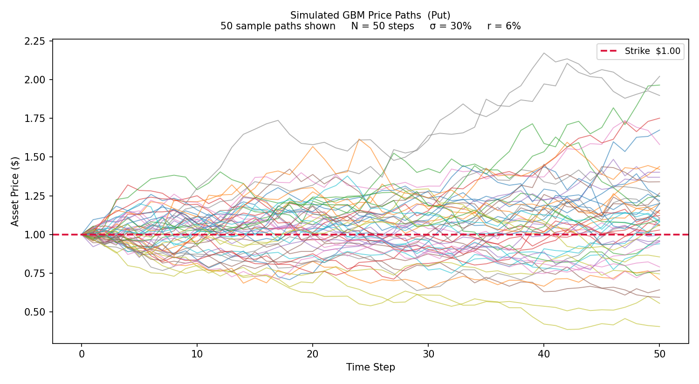
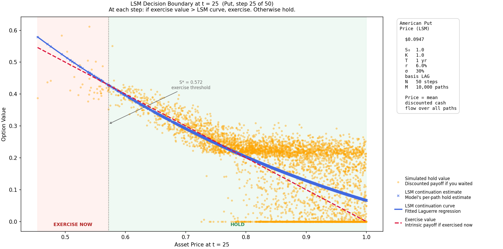

# Options Pricing

American and European option pricing via Least-Squares Monte Carlo (LSM) and Black-Scholes. Interactive Streamlit demo with four tabs: LSM pricer, Black-Scholes pricer, side-by-side comparison, and Greeks visualizer.

**Live demo:** [lsm-pricing-options.streamlit.app](https://lsm-pricing-options.streamlit.app/) &nbsp;|&nbsp; **Paper:** [Longstaff, Schwartz 2001](https://doi.org/10.1093/rfs/14.1.113)

---

## What is an Option?

An option is a contract that gives the holder the right to buy or sell an underlying asset at a fixed price (the strike price) on or before an expiration date.

**Put options** profit when the underlying asset falls below the strike price. If you hold a put with a strike of $100 and the asset falls to $80, exercising yields a $20 gain per share.

**Call options** profit when the underlying asset rises above the strike price. If you hold a call with a strike of $100 and the asset rises to $120, exercising yields a $20 gain per share.

**American vs. European:** American options can be exercised at any point before expiry. European options can only be exercised at expiry. This distinction matters enormously for pricing — the right to exit early has real value, which is what this model is designed to quantify.

The central question an American option pricing model answers: **at any given moment, is it better to exercise immediately and take the profit, or hold on in case it becomes more valuable later?**

---

## Method 1: Least-Squares Monte Carlo (American options)

The LSM method, introduced by Longstaff and Schwartz in 2001, answers this question by simulating thousands of possible future price paths and working backwards through time.

### Step 1: Simulate price paths

Asset prices are simulated using Geometric Brownian Motion (GBM), the standard stochastic process for equity prices. Each path represents one possible future trajectory of the asset from today to expiry.

```
S(t) = S(t-1) * exp( (r - 0.5 * σ²) * dt  +  σ * sqrt(dt) * Z )
```

where `r` is the risk free rate, `σ` is volatility, `dt` is the time step length, and `Z` is drawn from a standard normal distribution.



### Step 2: Backward induction

Starting from expiry and working backwards, at each timestep the algorithm:

1. Identifies which paths are **in the money** (immediate exercise is profitable)
2. Fits an **OLS regression** on those paths using polynomial basis functions. The regression estimates the **continuation value** — the expected payoff of holding the option longer rather than exercising now.
3. On each path, compares the immediate exercise payoff against the estimated continuation value. If exercising now is better, that path is marked as exercised at this timestep.

The three Laguerre basis functions used (eq. 5, Longstaff and Schwartz 2001):

```
L0(x) = exp(-x/2)
L1(x) = exp(-x/2) * (1 - x)
L2(x) = exp(-x/2) * (1 - 2x + x²/2)
```



The orange dots are the discounted future payoffs if the option is held. The dashed red line is the immediate exercise value. The blue curve is the fitted LSM regression — paths where the exercise value is above the blue curve should be exercised now. The shaded zones and S* marker show this boundary explicitly.

### Step 3: Average and discount

After all backward steps, the option price is the average discounted cash flow across all paths:

```
option_price = mean( V[:, t=1] ) * exp(-r * dt)
```

This single number is the fair value of the American option.

---

## Method 2: Black-Scholes (European options)

Black-Scholes (1973) is a closed-form analytical solution. It assumes log-normal asset prices, constant volatility, and **no early exercise** — which means it is only valid for European options.

```
d1 = ( ln(S0/K) + (r + σ²/2) * T ) / ( σ * √T )
d2 = d1 - σ * √T

Put:  P = K * e^(-rT) * N(-d2) - S0 * N(-d1)
Call: C = S0 * N(d1)  - K * e^(-rT) * N(d2)
```

Because it has no simulation step, it returns a result instantly. The tradeoff is that it cannot model early exercise.

---

## The Early Exercise Premium

The **early exercise premium** is the difference between the LSM American price and the Black-Scholes European price:

```
Early exercise premium = LSM price - BS price
```

This is always non-negative: an American option is worth at least as much as a European one with the same terms, because it can do everything the European can and more. The premium is larger when:

- The option is deeply in the money (early exercise is more attractive)
- There is a high risk-free rate (the time value of money makes waiting costly)
- Volatility is lower (less upside to waiting)

The Comparison tab in the demo shows this premium for any set of parameters.

---

## The Greeks

The Greeks measure how sensitive the option price is to changes in each input. Computed analytically from the Black-Scholes formula.

| Greek | Symbol | What it measures |
|---|---|---|
| Delta | δ | Change in option price per $1 move in the asset price |
| Gamma | γ | Rate of change of delta per $1 move in asset price |
| Vega | ν | Change in option price per 1% move in volatility |
| Theta | θ | Daily time decay — how much the option loses each day |
| Rho | ρ | Change in option price per 1% move in the risk-free rate |

The Greeks tab plots each of these as a curve across a range of asset prices, showing how sensitivity changes as the asset moves relative to the strike.

---

## Basis Functions

Longstaff and Schwartz recommend Laguerre polynomials but note that other orthogonal polynomial families produce similar results. The demo offers three choices:

| Basis | Formula | Notes |
|---|---|---|
| Laguerre | exp(-x/2) weighted derivatives | Default in the original paper |
| Chebyshev | T0=1, T1=x, T2=2x²-1 | First-kind Chebyshev polynomials |
| Legendre | P0=1, P1=x, P2=(3x²-1)/2 | Shifted Legendre polynomials |

All three produce similar prices in practice. The differences are mostly due to how the regression fits at the tails.

---

## Monte Carlo Convergence

Three parameters control the accuracy of the LSM estimate:

| Parameter | Effect |
|---|---|
| **M** (paths) | More paths reduce variance. Standard error scales as 1/sqrt(M). |
| **N** (time steps) | More steps better approximate continuous exercise rights. |
| **Basis functions** | More terms give a richer fit but can overfit with few paths. Three terms is standard. |

---

## Quick Start

```bash
git clone https://github.com/aleksejcupic/options-pricing
cd options-pricing
pip install -r requirements.txt

# Interactive demo
streamlit run app.py

# Command-line pricer (saves plots to images/)
python lsm_pricer.py
```

---

## Parameters

| Parameter | Symbol | Default | Description |
|---|---|---|---|
| Initial price | S0 | 1.00 | Starting asset price |
| Strike price | K | 1.00 | Agreed exercise price |
| Time to expiry | T | 1 yr | Duration of the contract |
| Risk free rate | r | 6% | Baseline return rate (e.g. 3-month treasury yield) |
| Volatility | σ | 30% | Annualised standard deviation of returns |
| Time steps | N | 50 | Exercise points (LSM only) |
| Paths | M | 10,000 | Simulated GBM paths (LSM only) |
| Basis | | Laguerre | Polynomial family for OLS regression (LSM only) |

---

## How to Use in Practice

This model uses stylised parameters (S0 = K = $1). To apply it to a real option:

1. Set **S0** to the current price of the underlying asset
2. Set **K** to the strike price from the option contract
3. Set **T** to the time remaining until expiration in years
4. Set **σ** to the implied or historical volatility of the asset
5. Set **r** to the current risk-free rate (e.g. the 3-month treasury yield)
6. Subtract any premium paid for the contract from the output price

Note: dividends are not modelled. If the underlying pays dividends, exercising early may cause the holder to miss them, which shifts the optimal exercise boundary.

---

## Why LSM Instead of Black-Scholes?

Black-Scholes is faster and exact for European options. LSM is needed when:

- The option is **American** (early exercise must be modelled)
- The underlying follows a **complex process** not captured by constant-volatility GBM
- The payoff is **path-dependent** (barrier options, Asian options)

For a standard American put or call on an equity with constant volatility, LSM and Black-Scholes applied to the European equivalent will give similar results. The difference between them — visible in the Comparison tab — is the early exercise premium.

**Binomial trees** are a third approach: at each node the price either goes up or down by a fixed percentage. They converge to Black-Scholes in the limit and handle American exercise naturally, but are less flexible than Monte Carlo for complex payoffs.

---

## References

Longstaff, F. A. and Schwartz, E. S. (2001). Valuing American options by simulation: a simple least squares approach. *The Review of Financial Studies*, 14(1), 113 to 147.

Black, F. and Scholes, M. (1973). The pricing of options and corporate liabilities. *Journal of Political Economy*, 81(3), 637 to 654.

Hull, J. (2001). *Fundamentals of Futures and Options Markets*. Prentice Hall.

Fatica, S. (2013). Pricing American options with Least Squares Monte Carlo on GPUs. NVIDIA GTC.

Clement, Lamberton, Protter (2002). An analysis of a least squares regression method for American option pricing. *Finance and Stochastics*.

---

## Authors

**Original project (May 2022)**

Aleksej Cupic, Gio Canales, Komi Alasse

Boston College, Morrissey College of Arts and Sciences  
CSCI2244 Randomness and Computation

The original project implemented GBM simulation and per-timestep regression visualization across three basis function families (Laguerre, Chebyshev, Legendre). The full project writeup is included in this repo as `Cupic_Randomness_Final_Project_Write_Up.pdf`.

**This version (2026)**

Aleksej Cupic

Completed the backward induction value matrix and added the final price calculation that was missing from the original. Expanded into a full four-tab Streamlit app including Black-Scholes pricing, Greeks, and an American vs. European comparison.
